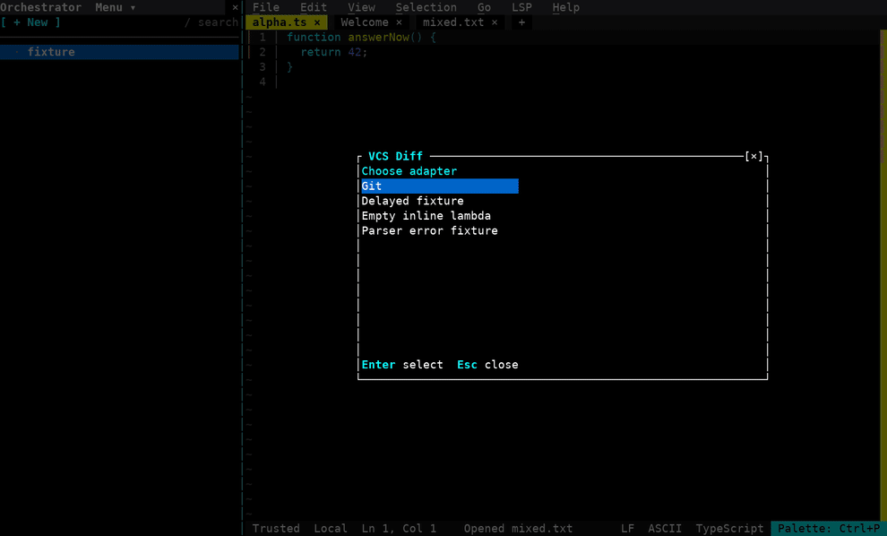
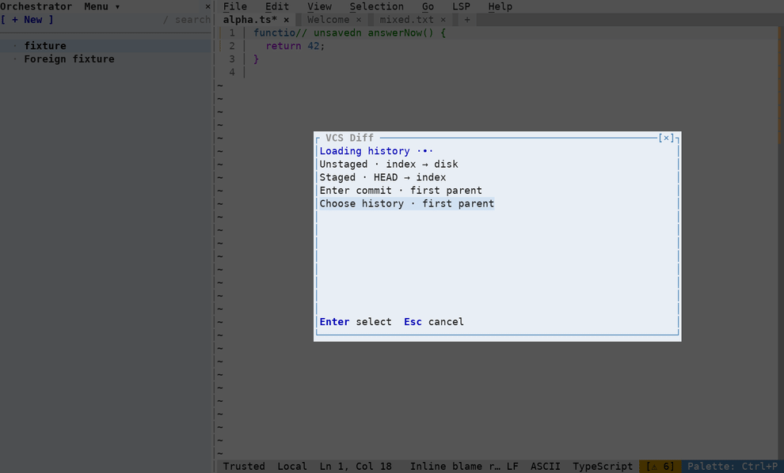
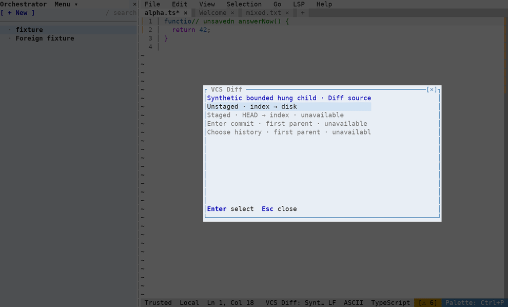
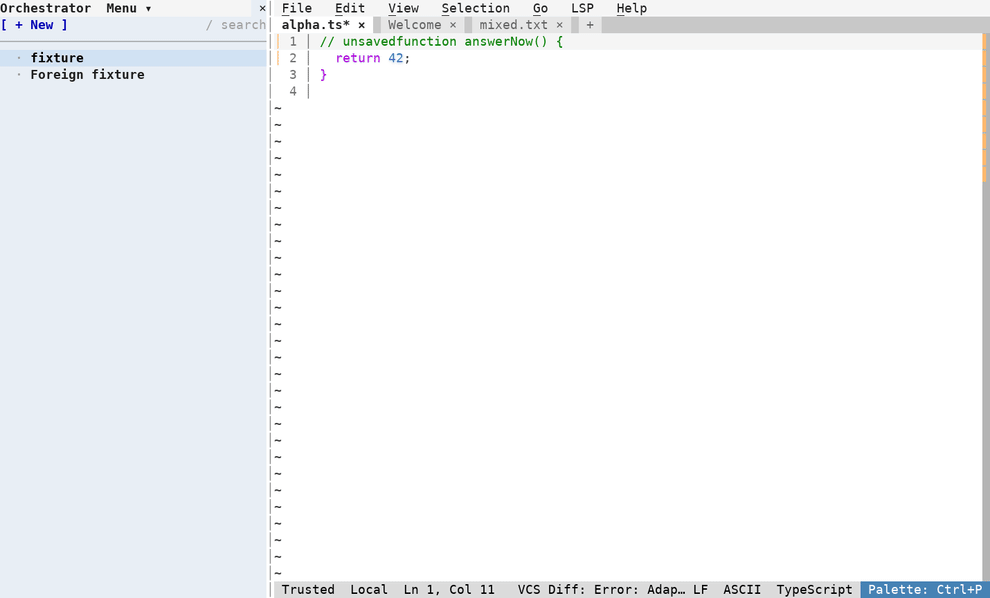

# VCS Diff for Fresh 0.5.2

Read-only **VCS Diff** picker (unstaged, staged, commit input, history) and **VCS Inline Blame**. The viewer shows every changed file in one vertical stream, with its own file tree, icons, status and line counts. Tab switches unified / side-by-side without losing the source-line anchor; Escape closes owned panes. The native Explorer is not modified. No reset, stage, apply or rollback operations.

## Trusted configuration

Install the built `vcs_diff.ts` into `<Fresh config dir>/plugins/vcs_diff.ts`. Set Fresh JSON (the underscore namespace is intentional):

```json
{"plugins":{"vcs_diff":{"settings":{"adapterConfig":"vcs-diff/config.js"}}}}
```

Create `<Fresh config dir>/vcs-diff/config.js` as a **trusted JS expression**; copy the supplied `presets` directory beside it:

```js
({ adapters: [load('./presets/git.js'), load('./presets/arc.js')] })
```

There is no config discovery in the opened project. Paths are absolute or relative to the Fresh config directory. `load` resolves relative to the containing trusted expression. Code executes in the plugin realm, not a sandbox. ESM, CommonJS, dynamic import and TypeScript user config are not supported. Each command rereads the config; no rebuild is needed. For one adapter, omit the other preset.

Custom lambdas can live directly inside the expression:

```js
({adapters: [{
  name: 'Example',
  capabilities: {sources: ['unstaged'], history: false, content: false, blame: false},
  diff: ({cwd, source, revision}) => ({
    command: 'printf', args: ['%s', '{"files":[]}'],
    parse: stdout => JSON.parse(stdout)
  })
}]})
```

Adapters construct exactly four operations: `diff({cwd,source,revision})`, `history({cwd,limit})`, `content({cwd,path,revision})`, `blame({cwd,path})`. Each returns `{command,args,parse(stdout)}`; `cwd` is passed separately to the direct executable spawn. No shell. The neutral runner prefixes the executable with GNU coreutils `timeout`; the lambda API is unchanged. Optional operations must declare their capabilities. See `lib/model.ts` for the normalized model: zero-based half-open ranges, explicit empty sides, opaque content revisions, and ready-to-display blame labels. Presets are separate runtime expressions, never bundled into the viewer.

Git compares index→disk, HEAD→index and commit→first parent; root commits compare against empty sides. Merge commits use the first parent, and history walks first parents. Arc requests its own JSON history/blame and Git-format patches. Read-only live checks of the existing `.arcignore` cover all four operations, HEAD/index/disk content, and show-versus-first-parent diff on a merge. Changed staged/index, root-commit and subdirectory semantics remain acceptance gaps until verified. Binary files retain headers/metadata without text content. Dirty buffers are refused for blame; edits remove stale labels instead of attributing unsaved lines.

## Limits and safety

Local authorities only. Up to 1,000 files, 10,000 hunks, history requests of 100 entries (schema cap 200), 20,000 blame ranges, 512-character blame/history labels and 4 MiB per command stdout. Stdout is file-backed; only a bounded prefix enters JS. GNU coreutils `timeout` bounds each adapter invocation to 15 seconds plus a 1-second TERM→KILL grace; output growth is polled. Parser/schema/command/path failures are surfaced rather than shown as empty results. Both source snapshots, file headers and newline padding share an incremental 8 MiB budget. Loading stops before requesting further content when it is exceeded.

**GNU coreutils `timeout` is required** (`gtimeout` on systems that install it under that name). Before any adapter process, the runner checks `--version`; a missing or unsupported dependency fails clearly, with no unbounded fallback. Set `plugins.vcs_diff.settings.timeoutCommand` to its executable name or absolute path if needed. The runner executes `timeout --signal=TERM --kill-after=1s 15s <command> ...args` directly, without a shell or `--foreground`, so the child process group receives the deadline signals.

Fresh 0.5.2's foreground `kill()` may return `false`. Escape stops UI immediately, but **wait/retry until actual backend exit** (at most the remaining deadline plus kill grace); the busy lock and staging stay owned until that exit. Native tests cover hung TERM-ignoring children and descendants, actual termination, lock release, reopening and scratch cleanup. Timeout exits are errors, never empty diffs. Disk growth can overshoot polling; native stderr capture has no hard quota. This is a lifetime bound, not a hard disk/stderr quota or immediate-termination guarantee. Processes that intentionally escape the owned process group are outside this standard timeout mechanism.

**Source markers are static:** saved open buffers receive added/modified/deleted indicators after an unstaged diff. There is no gutter mouse handler, hover action, preview or substitute keybinding. Normal folding is left to Fresh. Edits invalidate static markers; rerun an unstaged diff to refresh them. The former click-preview blocker is resolved by this product scope decision. Live Arc staged/unstaged recordings require permission for a concrete test subtree; synthetic fixtures are not live Arc evidence. Full acceptance is not claimed.

## Native demo

<!-- demo-video:start -->
[](assets/demo.mp4)

[](assets/states/demo.mp4)

[](assets/limits/demo.mp4)

[](assets/cancel/demo.mp4)
<!-- demo-video:end -->

See `assets/provenance.json` for actual scenario coverage, recording/source hashes and full media decode results. Synthetic slow/error adapters are labelled separately from temporary real Git scenes. No external publication is needed.

## Checks

Build with isolated esbuild 0.25.12. Native recording uses an isolated Python venv with `packages/search-everywhere/tests/requirements-demo.txt`, the existing shared demo dependencies; known DejaVu and Nerd symbol fonts are required:

```sh
node scripts/build-package.mjs /tmp/isolated-esbuild-prefix /tmp/vcs-diff-package
node --experimental-strip-types --test tests/core.test.ts
ESBUILD_PREFIX=/tmp/isolated-esbuild-prefix node --test tests/package.test.mjs
python tests/smoke.py /path/to/fresh /tmp/vcs-diff-package
# Exact existing file, read-only; never creates or edits an Arc test area:
node --experimental-strip-types tests/live_arc.mjs /authorized/arc/root /tmp/arc-evidence
```
